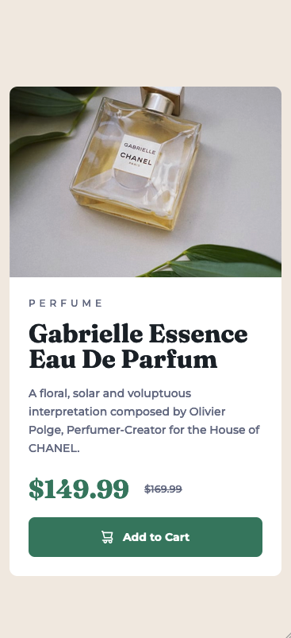
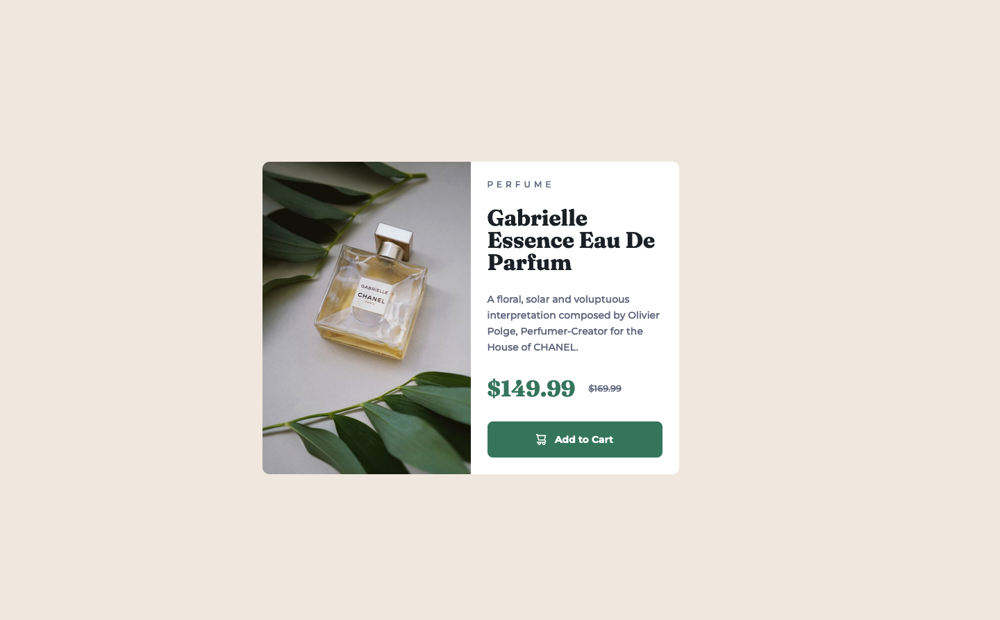

# Frontend Mentor - Product preview card component solution

This is a solution to the [Product preview card component challenge on Frontend Mentor](https://www.frontendmentor.io/challenges/product-preview-card-component-GO7UmttRfa). Frontend Mentor challenges help you improve your coding skills by building realistic projects.

## Table of contents

- [Overview](#overview)
  - [The challenge](#the-challenge)
  - [Screenshots](#screenshot)
  - [Links](#links)
- [My process](#my-process)
  - [Built with](#built-with)
  - [What I learned](#what-i-learned)
  - [Useful resources](#useful-resources)
- [Author](#author)

## Overview

### 🫡 The challenge

Users should be able to:

- View the optimal layout depending on their device's screen size
- See hover and focus states for interactive elements

### 📸 Screenshots




### Links

- [Live Demo](https://product-preview-card-component-psi-seven.vercel.app/)

## My process

### 🧱 Built with

- Semantic HTML5 markup
- CSS custom properties
- Flexbox
- CSS Grid
- Mobile-first workflow

### 🤓 What I learned

On the surface, this a very easy challenge, but there was a lot of opportunity to go deeper in certain aspects which could make the project better. Some of these included:

- Making accessible HTML content for screen-readers only

```html
<div class="product-price-container">
  <p class="sale-price"><span class="sr-only">Sale Price: </span>$149.99</p>
  <p class="original-price">
    <span class="sr-only">Original Price: </span>$169.99
  </p>
</div>
```

```css
/* Screen Reader: Hide content, but show for screenreader (to add context) */

.sr-only:not(:focus):not(:active) {
  clip: rect(0, 0, 0, 0);
  clip-path: inset(50%);
  height: 1px;
  overflow: hidden;
  position: absolute;
  white-space: nowrap;
  width: 1px;
}
```

- Making use of HTML Data attributes (used later to grab CSS elements)

```html
<button class="btn" data-icon="shopping-cart">Add to Cart</button>
```

- Using CSS Psuedo elements (used to put shopping cart icon in button)

```css
.btn[data-icon="shopping-cart"]::before {
  content: "";
  background-image: url("./images/icon-cart.svg");
  width: 15px;
  height: 16px;
}
```

- Making use of the HTML `<picture>` tag in order to handle the image change going from mobile to deskop versions.

```html
<picture class="product-image">
  <source media="(min-width:600px)" srcset="images/image-product-desktop.jpg" />
  
</picture>
```

### Useful resources

- [Taking on a Frontend Mentor challenge | Responsive Product Preview Card Component by Kevin Powell](https://www.youtube.com/watch?v=B2WL6KkqhLQ) - Although this was quite a simple and straight forward challenge, Kevin's video is great because he dives into deeper topics like how to properly structure your semantic HTML, the use of the `<picture>` tag, making content accessible and much more than just what the challenge covers.

## Author

- Website - [Geoff Jamieson](https://www.geoffjamieson.com/)
- Frontend Mentor Profile - [@UnionPAC](https://www.frontendmentor.io/profile/UnionPAC)
- LinkedIn - [linkedin/geoffjamieson](https://www.linkedin.com/in/geoffjamieson/)
